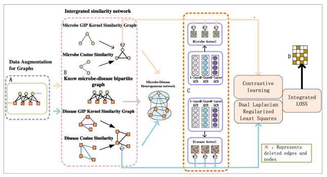
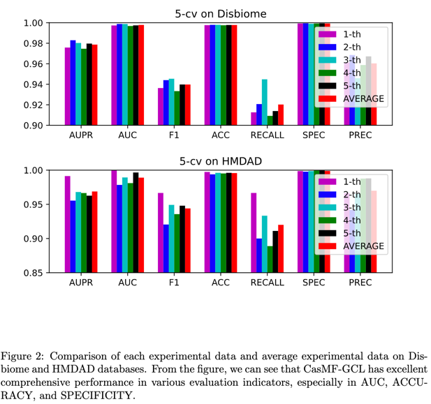
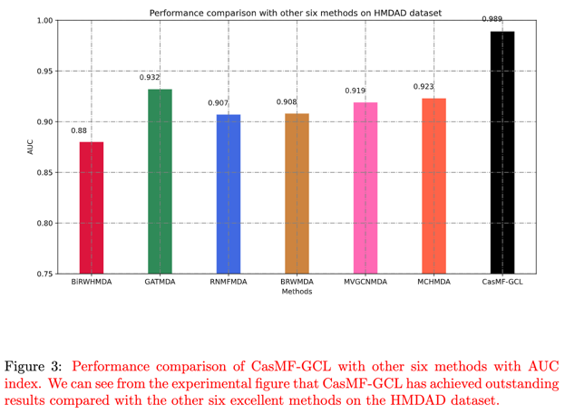
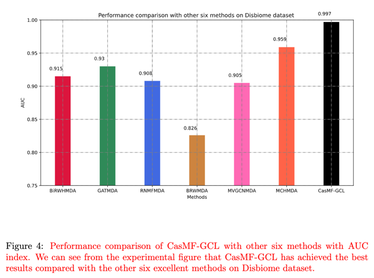
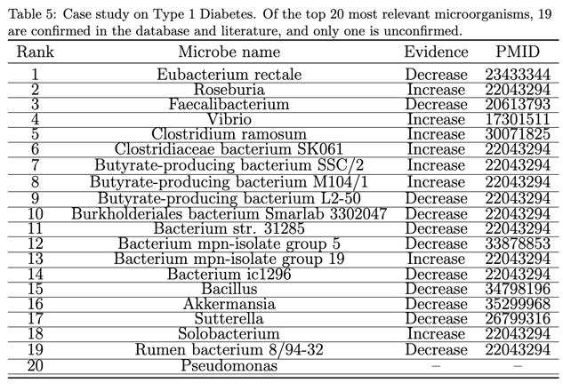
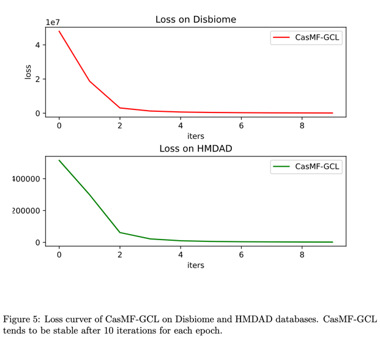
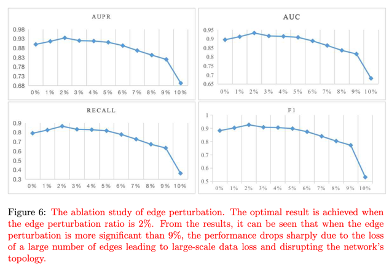
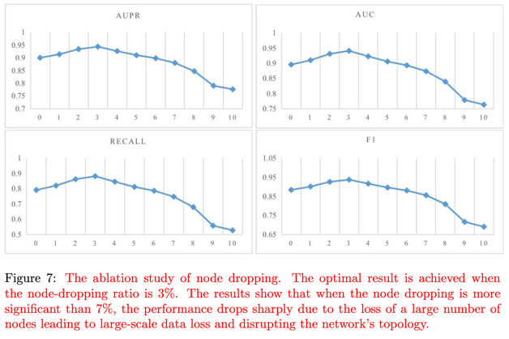

# CasMF-GCL
**Sparse Graph Cascade Multi-kernel Fusion Contrastive Learning for Microbe-Disease Association Prediction.**

Predicting microbe-disease associations (MDA) is crucial for proactively demystifying diseases' causes and preventing them. Traditional prediction methods endure labor-intensive, time-consuming, and expensive. 
Therefore, this paper proposes CasMF-GCL, a novel Graph Contrastive Learning model based on sparse relation augmentation and a Cascaded Multi-kernel Fusion Network for MDA prediction. CasMF-GCL maximizes the use of sparse correlation information and eliminates data noise through an association augmentation technique based on low-rank sparse matrix completion. We employ diverse strategies to enhance the features of heterogeneous networks by exploring the similarity between microbes and diseases. Our model employs a new multi-layer graph convolutional network variant with a cascaded multi-kernel fusion mechanism, enabling weighted coding of local and global features for diseases and microbes. To further improve performance, we incorporate a self-supervised contrastive learning schema using multi-grain disease and microbe features and large-scale relation augmentations. Extensive experiments on two renowned datasets demonstrate that CasMF-GCL outperforms current state-of-the-art methods, showcasing its robustness and generalization capability. The AUC values from 5-fold cross-validation are 0.997 and 0.989 for the two datasets, respectively. Ablation studies confirm the effectiveness of graph data augmentation, the power of the contrastive strategy, and the indispensability of the cascaded multi-kernel fusion network. Furthermore, case studies validate the prediction performance of CasMF-GCL.

# Datasets
1)HMDAD: (http://www.cuilab.cn/hmdad). The Human Microbe-Disease Association Database (HMDAD) is a resource which collected and curated the human microbe-disease association data from microbiota studies. Currently, users can search and browse the database. In addition, a Download page for downloading the whole dataset in the database was also provided. Currently, HMDAD integrated 483 disease-microbe entries which include 39 diseases and 292 microbes;

2)Disbiome: (https://disbiome.ugent.be/home), Disbiome is a database covering microbe composition changes in different kinds of diseases, managed by Ghent University. Disease names, detection methods or organism names can be used as search queries giving you all information related to the experiment (related disease/bacteria, abundancy subject/control, control type, detection method and related literature;

# Experiments 

# Requirements
* Python 3.7
* Pytorch
* PyTorch Geometric
* numpy
* scipy